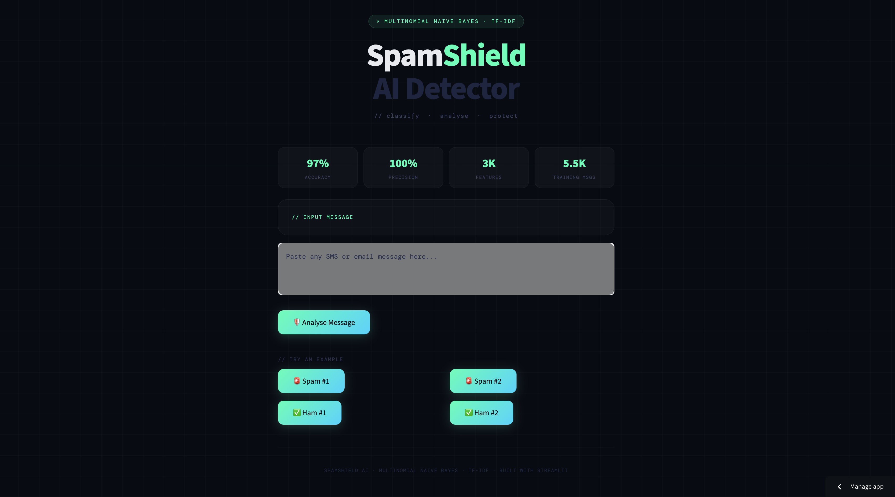
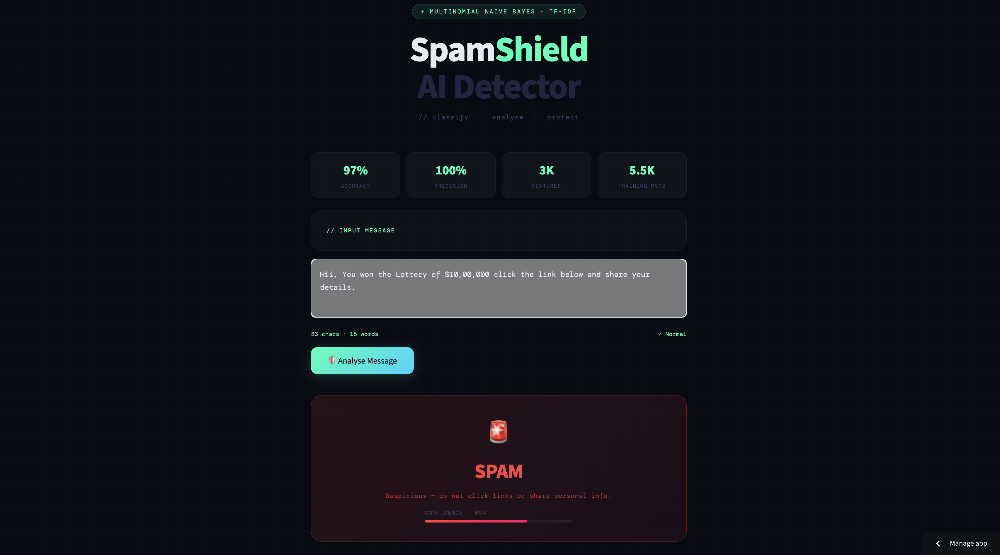
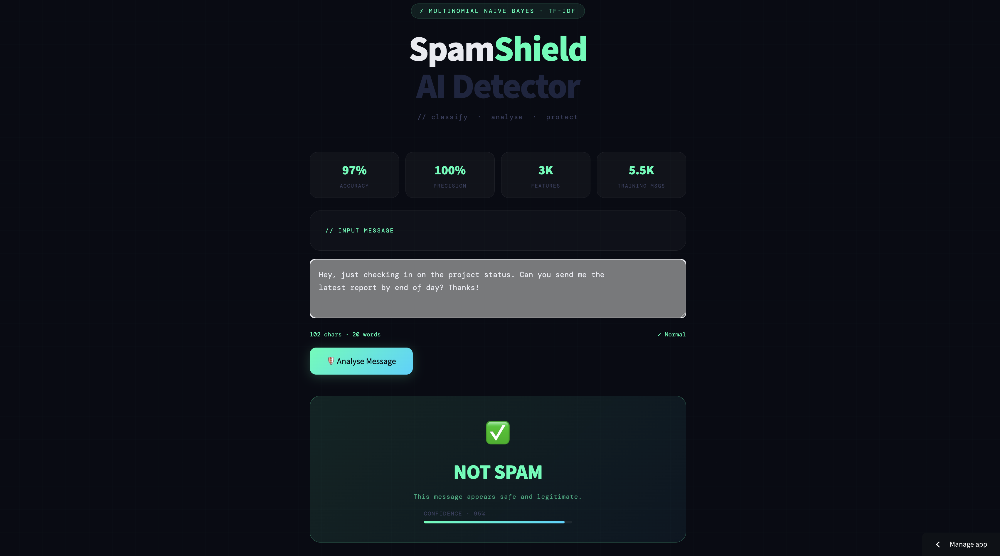

# 🛡️ NLP-Spam-Classifier-Project

> An end-to-end NLP project that classifies SMS/Email messages as Spam or Ham. Built with Python, NLTK &amp; Scikit-learn using Tokenization, Stemming, TF-IDF Vectorization and Multinomial Naive Bayes. Achieves 97% accuracy &amp; 100% precision on 5,572 messages. Deployed as an interactive web app using Streamlit.


## 🌐 Live Demo

👉 **[Try the App Here](https://nlpspamclassifierproject-xgtfrjue5lszz9wtlfy5b9.streamlit.app/)**

### 🖼️ Screenshots





---

## 📌 Table of Contents

- [📖 Overview](#-overview)
- [✨ Features](#-features)
- [📊 Exploratory Data Analysis](#-exploratory-data-analysis)
- [📁 Project Structure](#-project-structure)
- [🔧 NLP Pipeline](#-nlp-pipeline)
- [📈 Model Performance](#-model-performance)
- [⚙️ Installation](#️-installation)
- [🚀 How to Run](#-how-to-run)
- [🛠️ Tech Stack](#️-tech-stack)
- [✅ Results](#-results)
- [🙌 Acknowledgements](#-acknowledgements)

---

## 📖 Overview

This is a complete end-to-end machine learning project that detects whether an SMS or Email message is **Spam** or **Ham (Not Spam)**. The project covers the entire ML workflow — from raw data cleaning and exploratory data analysis, to text preprocessing, model training, model comparison, and deployment as a web application.

The model was trained on the **SMS Spam Collection Dataset** containing 5,572 real-world messages and uses a **Multinomial Naive Bayes** classifier with **TF-IDF Vectorization** to achieve state-of-the-art results.

---

## ✨ Features

- ⚡ Real-time spam detection with confidence score
- 🔤 Complete NLP text preprocessing pipeline
- 🤖 10 machine learning algorithms compared
- 🎨 Interactive dark-themed Streamlit web app ([see screenshot](./screenshots/app-interface.png))
- 🕓 Prediction history tracking ([see screenshot](./screenshots/history.png))
- 💡 Example spam and ham messages to test instantly
- ☁️ Word cloud visualizations for spam and ham
- 🔢 Live character and word counter in the UI

---
## 📊 Exploratory Data Analysis
### 📦 Dataset

| Property | Details |
|----------|---------|
| Name | SMS Spam Collection Dataset |
| Source | [UCI Machine Learning Repository](https://www.kaggle.com/datasets/uciml/sms-spam-collection-dataset) |
| Total Messages | 5,572 |
| Spam Messages | 747 (13.4%) |
| Ham Messages | 4,825 (86.6%) |
| Features | Message text |
| Target | spam / ham |

> ⚠️ The dataset is imbalanced — 86.6% ham vs 13.4% spam. This makes **precision** a more important metric than accuracy to avoid false positives where a legitimate message is wrongly marked as spam.

### 🔥 Feature Correlation Heatmap ([Correlation Heatmap image](./screenshots/correlation-heatmap.png))

| Feature Pair | Correlation | Insight |
|--------------|-------------|---------|
| num_characters ↔ num_words | 0.97 | 🔴 Extreme multicollinearity |
| num_characters ↔ message_type | 0.38 | 🟠 Moderate predictor |
| num_words ↔ num_sentences | 0.68 | 🟠 Moderate correlation |
| num_sentences ↔ message_type | 0.26 | ⚪ Weak predictor |

> **Decision:** Selected TF-IDF features (3,000 dimensions) over raw counts to avoid multicollinearity and capture semantic meaning.

### 🚨 Top Spam Keywords ([Spam Word Cloud image](./screenshots/wordcloud-spam.png))

> **Most Common Spam Words:**
 - free, call, click, winner, prize, cash, urgent, claim, text, reply

**Pattern:** Action-oriented words designed to prompt immediate user response.

### ✅ Top Ham Keywords ([Ham Word Cloud Image](./screenshots/wordcloud-ham.png))

> **Most Common Ham Words:**
 - thanks, meeting, tomorrow, please, hello, time, work, day, good, see

 **Pattern:** Natural conversational language for legitimate communication.

### 📈 Top 30 Spam Keywords ([Bar Chart Image](./screenshots/top-spam-keywords.png))

> Frequency analysis shows which words are strongest spam indicators. Keywords like "call", "free", "winner" appear exclusively in spam messages.

---

## 📁 Project Structure

```
nlp-spam-classifier/
│
├── app.py                  # Streamlit web application
├── spam_detection.ipynb    # Full project notebook (EDA + Training)
├── model.pkl               # Trained Multinomial Naive Bayes model
├── vectorizer.pkl          # Fitted TF-IDF vectorizer
├── spam.csv                # Dataset
├── requirements.txt        # Python dependencies
└── README.md               # Project documentation
```

---

## 🔧 NLP Pipeline

Every message goes through this preprocessing pipeline before prediction:

```
📩 Raw Message
    ↓
1. 🔡 Lowercase conversion
    ↓
2. ✂️  Tokenization             (nltk.word_tokenize)
    ↓
3. 🔣 Remove special chars     (keep only alphanumeric)
    ↓
4. 🛑 Remove stop words        (nltk.corpus.stopwords)
    ↓
5. ❌ Remove punctuation       (string.punctuation)
    ↓
6. 🌱 Stemming                 (PorterStemmer)
    ↓
7. 📐 TF-IDF Vectorization     (max_features=3000)
    ↓
🤖 Multinomial Naive Bayes Prediction
```

**Example:**
```
Input  :  "FREE entry! Win a $1000 prize. Call NOW!!!"
Output :  "free entry win prize call"
```

---

## 📈 Model Performance

### 🏆 All 10 Algorithms Compared

| Algorithm | Accuracy | Precision |
|-----------|----------|-----------|
| 🌲 Extra Trees (ETC) | 98.36% | 100.00% |
| 🌳 Random Forest (RF) | 97.87% | 98.33% |
| ⭐ Multinomial NB | 97.58% | 100.00% |
| 🔷 SVC | 97.58% | 97.48% |
| 📉 Logistic Regression | 95.84% | 96.12% |
| 🎒 Bagging Classifier | 95.74% | 84.06% |
| 📈 Gradient Boosting | 94.49% | 90.10% |
| 🌿 Decision Tree | 93.33% | 87.10% |
| 🚀 AdaBoost | 91.88% | 86.49% |
| 📍 K-Nearest Neighbors | 90.52% | 100.00% |

### 🤔 Why Multinomial NB was chosen

Three models achieved 100% precision — ETC, KNN and Multinomial NB. Here is why MNB was the final choice:

| Model | Accuracy | Precision | Verdict |
|-------|----------|-----------|---------|
| Extra Trees | 98.36% | 100.00% | ❌ Heavy — uses 50 trees, slow to deploy |
| K-Nearest Neighbors | 90.52% | 100.00% | ❌ Low accuracy, slow on large data |
| **Multinomial NB** | **97.58%** | **100.00%** | ✅ Best balance — fast, accurate, lightweight |

- ✅ 100% Precision — zero false positives, no legitimate message marked as spam
- ✅ 97.58% Accuracy — significantly higher than KNN (90.52%)
- ✅ Lightweight and fast — ideal for real-time web deployment
- ✅ Best suited for text and NLP classification tasks

### 🧪 3 Naive Bayes Variants Compared

| Model | Accuracy | Precision |
|-------|----------|-----------|
| ⭐ Multinomial NB | 97.58% | 100.00% |
| Bernoulli NB | 98.33% | 99.24% |
| Gaussian NB | 87.63% | 71.76% |

---

## ⚙️ Installation

**1. Clone the repository**
```bash
git clone https://github.com/MANOJKUMARKONDURU/NLP_Spam_Classifier_Project.git
cd NLP_Spam_Classifier_Project
```

**2. Install dependencies**
```bash
pip install -r requirements.txt
```

**3. Download NLTK data**
```python
import nltk
nltk.download('punkt')
nltk.download('stopwords')
```

---

## 🚀 How to Run

**Run the Streamlit app locally:**
```bash
streamlit run app.py
```

Then open your browser at `http://localhost:8501`

> 📝 Make sure `model.pkl` and `vectorizer.pkl` are in the same directory as `app.py`. If not, run the full notebook first to generate them.

---

## 🛠️ Tech Stack

| Category | Tools |
|----------|-------|
| 🐍 Language | Python 3.8+ |
| 🔤 NLP | NLTK, String |
| 🤖 ML | Scikit-learn |
| 📐 Vectorization | TF-IDF (max_features=3000) |
| 🧠 Model | Multinomial Naive Bayes |
| 📊 Visualization | Matplotlib, Seaborn, WordCloud |
| 🌐 Web App | Streamlit |
| 💾 Serialization | Pickle |
| 📓 Notebook | Google Colab |

---

## ✅ Results

```
🤖 Model        :  Multinomial Naive Bayes
📐 Vectorizer   :  TF-IDF (max_features=3000)
🎯 Accuracy     :  97.58%
✅ Precision    :  100.00%
🧪 Test Size    :  20%  (1,114 messages)
📚 Train Size   :  80%  (4,458 messages)
🎲 Random State :  2
```

---

## 🙌 Acknowledgements

- 📦 Dataset: [SMS Spam Collection — Kaggle / UCI](https://www.kaggle.com/datasets/uciml/sms-spam-collection-dataset)
- 🔤 NLTK for NLP preprocessing tools
- 🤖 Scikit-learn for machine learning algorithms
- 🌐 Streamlit for the interactive web interface

---

<p align="center">Built with ❤️ using Python · NLTK · Scikit-learn · Streamlit</p>
